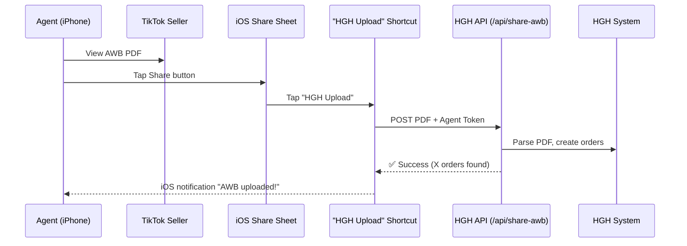

# Direct Share AWB to HGH — iOS Solution Discussion

> [!CAUTION]
> **Business Critical**: If Agents can't share AWB PDFs directly from TikTok Seller → HGH in 1-2 taps, they won't use the system. The current "Download → Save → Open HGH → Select PDF" flow is too many steps.

## The Problem

| Step | Current Flow (Rejected) | What Agents Want |
|:-----|:------------------------|:-----------------|
| 1 | Open TikTok Seller, view AWB | Open TikTok Seller, view AWB |
| 2 | Download PDF to Files app | Tap **Share** |
| 3 | Open HGH app | Tap **HGH** in Share Sheet |
| 4 | Navigate to Upload AWB | ✅ Done. PDF auto-processed. |
| 5 | Tap Select PDF | — |
| 6 | Browse Files, find PDF | — |
| 7 | ✅ Done | — |

**7 steps vs 3 steps.** Agents will send to WhatsApp instead.

## Why Web Share Target Failed

Web Share Target API (what we built in Version 0.6.1) **only works on Android Chrome**. Apple/iOS Safari does **not** support it and has no plans to. Since most Agents likely use iPhones, this is a dead end for iOS.

---

## Proposed Solutions

### ✅ Option A: iOS Shortcut + API Endpoint (Recommended)

**How it works**: Apple's built-in **Shortcuts** app can appear in the iOS Share Sheet, receive files, and send HTTP requests — no App Store needed.

#### Agent Experience (After 1-Time Setup):

#### What We Build:

| Component | Description |
|:----------|:------------|
| **`/api/share-awb.js`** | Vercel serverless endpoint. Accepts `multipart/form-data` with PDF file + auth token. Runs `TikTokPdfParser`, creates orders in DB. |
| **Agent Upload Token** | Each Agent gets a unique token (stored in `Staff` table). Used to authenticate the Shortcut. |
| **Pre-built iOS Shortcut** | Downloadable via link (e.g. `hghsejahtera.my/shortcut`). Agent installs once → appears in Share Sheet forever. |
| **Setup page in HGH** | Simple page showing Agent's token + "Install Shortcut" button with QR code. |

#### Pros & Cons:

| Pros | Cons |
|:-----|:-----|
| ✅ Appears in iOS Share Sheet natively | ⚠️ Agent needs 1-time Shortcut installation |
| ✅ No App Store needed | ⚠️ Only works on iOS (Android uses existing PWA Share Target) |
| ✅ 3-tap flow (Share → HGH Upload → Done) | |
| ✅ Works with any app that shares PDFs | |
| ✅ Can be built in 1-2 days | |
| ✅ Zero-click auto-processing on server side | |

---

### Option B: TikTok Shop API Integration

**How it works**: Skip PDFs entirely. Connect directly to TikTok Shop API to pull orders and AWB data automatically.

| Pros | Cons |
|:-----|:-----|
| ✅ Zero manual work for Agents | ❌ Requires TikTok Shop API access & approval |
| ✅ Eliminates PDF upload entirely | ❌ Business owner must authorize API connection |
| ✅ Real-time order sync | ❌ Longer development time (weeks) |
| | ❌ API rate limits and TikTok policy changes |

> [!NOTE]
> This is the **ideal long-term solution** but requires TikTok Shop seller account authorization and API onboarding. Can be Phase 2.

---

### Option C: Native App Wrapper (Capacitor/Expo)

**How it works**: Wrap HGH web app in a native iOS shell with a Share Extension.

| Pros | Cons |
|:-----|:-----|
| ✅ Full native Share Sheet integration | ❌ Requires Apple Developer Account ($99/year) |
| ✅ No Shortcut installation needed | ❌ App Store review process (days-weeks) |
| | ❌ Maintenance burden for native wrapper |
| | ❌ Significant development effort |

---

### Option D: Email-Based Upload

**How it works**: Each Agent gets a unique email like `awb-AGT001@hgh.my`. Share PDF to that email → system auto-processes.

| Pros | Cons |
|:-----|:-----|
| ✅ Works on any device | ❌ Requires email infrastructure (Mailgun/SendGrid) |
| ✅ Simple for Agents | ❌ Processing delay (not instant) |
| | ❌ Monthly cost for email service |

---

### Option E: Telegram Bot

**How it works**: Agent sends PDF to a Telegram bot → bot processes and uploads to HGH.

| Pros | Cons |
|:-----|:-----|
| ✅ Works on any device | ❌ Agents need Telegram installed |
| ✅ Free API | ❌ Extra app dependency |
| ✅ Instant processing | ❌ Agent must link Telegram to HGH account |

---

## Recommendation

> [!IMPORTANT]
> **Option A (iOS Shortcut + API)** is the fastest, cheapest, and most practical solution.
> 
> - **Build time**: 1-2 days
> - **Cost**: $0 (uses existing Vercel serverless)
> - **Agent setup**: Install Shortcut once (30 seconds)
> - **Daily UX**: 3 taps (Share → HGH Upload → Done)
> - **Works alongside**: Existing Android PWA Share Target

### Combined Platform Coverage:

| Platform | Solution | Share Sheet Icon |
|:---------|:---------|:----------------|
| **iOS (iPhone)** | iOS Shortcut | ✅ "HGH Upload" |
| **Android** | PWA Web Share Target | ✅ "HGH Sejahtera" |

Both platforms covered. Agents get the same 3-tap experience regardless of phone.
